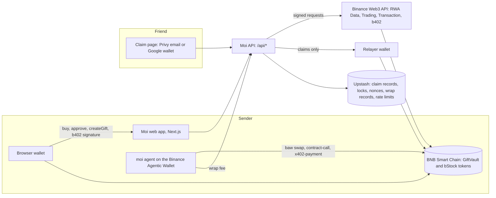
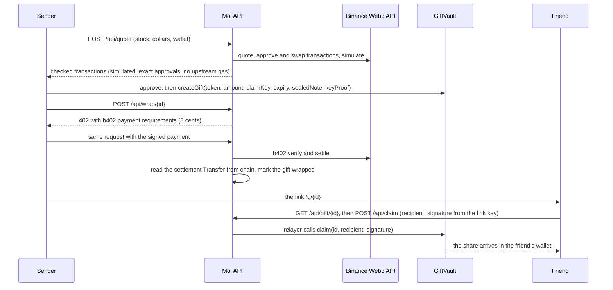
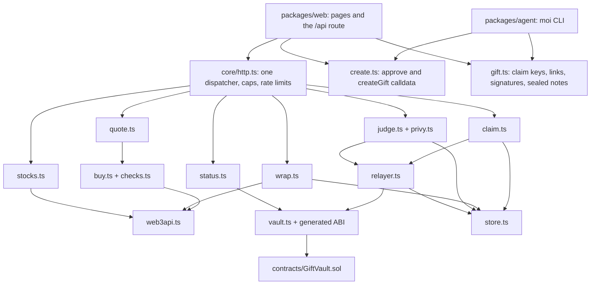

# Moi architecture

Moi lets someone give a friend a real tokenized share with a link. This page is the map: what runs
where, how one gift moves, and the exact calls the website makes.

## Deployed (BNB Smart Chain mainnet, chain id 56)

| Thing | Address |
|---|---|
| GiftVault | [0x808EB6B3dC1ad50Ca114F5eA9d053BEAd958975C](https://bscscan.com/address/0x808EB6B3dC1ad50Ca114F5eA9d053BEAd958975C) (source verified, immutable) |
| Owner (pause, token list, relayer) | 0x96E854aBDdc5C618ca843956d1303017b586aB75 |
| Relayer (submits claims, pays their gas) | 0x93596EBf4e4B3ACEAb8Af2B4FeA6157e3F7fb7A9 |
| Gift wrapping fees settle to | 0x96E854aBDdc5C618ca843956d1303017b586aB75 |
| Giftable stocks (bStocks) | AAPLB, NVDAB, TSLAB, MSFTB, AMZNB, GOOGLB, METAB, SPYB, QQQB (read live with `listedTokens()`) |

## 1. System overview

## 2. One gift, end to end

## 3. Modules and what depends on what

## 4. The interface the website uses

All endpoints answer JSON with `Cache-Control: no-store` (except the stock list, cached 30 s) and a
fixed error code on refusal; no upstream text ever reaches the browser.

| Endpoint | Body | Answer |
|---|---|---|
| `GET /api/stocks` | none | `{stocks: [{address, symbol, name, decimals, uiMultiplier, priceUsd, market: {open, reasonCode, reasonMsg, nextOpenTime}, logoUrl}], asOf}` |
| `POST /api/quote` | `{stock, usdAmount, wallet}` | `{ok, step: "approve", approveTx}` or `{ok, step: "swap", stock, usdAmount, swapTx, vaultApproveTx, expectedOut, minOut, priceUsd}`; transactions carry only to, data and value |
| `GET /api/gift/{id}` | none | `{ok, giftId, state, token, symbol, name, decimals, amountRaw, shares, expiry, claimKey, sealedNote, senderCompliant}` |
| `POST /api/wrap/{id}` | none, then the same with a `PAYMENT-SIGNATURE` header | `402` with `PAYMENT-REQUIRED`, then `200 {ok, wrapped, txHash}`; `202 settlement_pending` means replay the same header |
| `POST /api/claim` | `{giftId, recipient, signature, declaration: true}` | `{ok, txHash, reused}` |
| `POST /api/judge` | `{judgeCode, accessToken, recipient, walletProof, issuedAt, declaration: true}` | `{ok, giftId, txHash}` |

What the browser does itself, never the server:
- Sender: makes the claim key (`newClaimKey`), the key proof (`signKeyProof`), the sealed note
  (`sealNote`), and the approve and createGift transactions (`buildApproveVaultTx`,
  `buildCreateGiftTx`); reads the gift id from the receipt (`readGiftIdFromReceipt`); builds the link
  (`buildLink`).
- Friend: reads the key from the link fragment (`parseLink`), checks it matches the gift
  (`claimKeyMatches`), opens the note (`openNote`), signs the claim for their Privy wallet
  (`signClaim`), and shows "claimed" only after the receipt holds the GiftClaimed event.
- Judge: signs `judgeWalletMessage` with the Privy wallet and sends it with the Privy access token
  and the judge code.

## 5. Security model

The rules the code keeps are in [docs/security/threat-model.md](docs/security/threat-model.md)
(invariants C1 to C50, non-goals N1 to N9). In short: only the link's key can release a gift and only
to the recipient it signed for; only Moi's relayer submits claims; unclaimed gifts return to the
sender after expiry; nobody, the owner included, can move a gift; and the vault refuses to release
a gift whose sender the bStock's own compliance contract now refuses.
