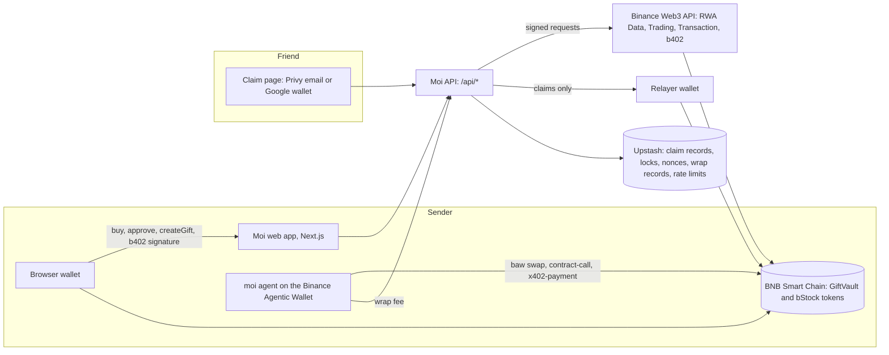
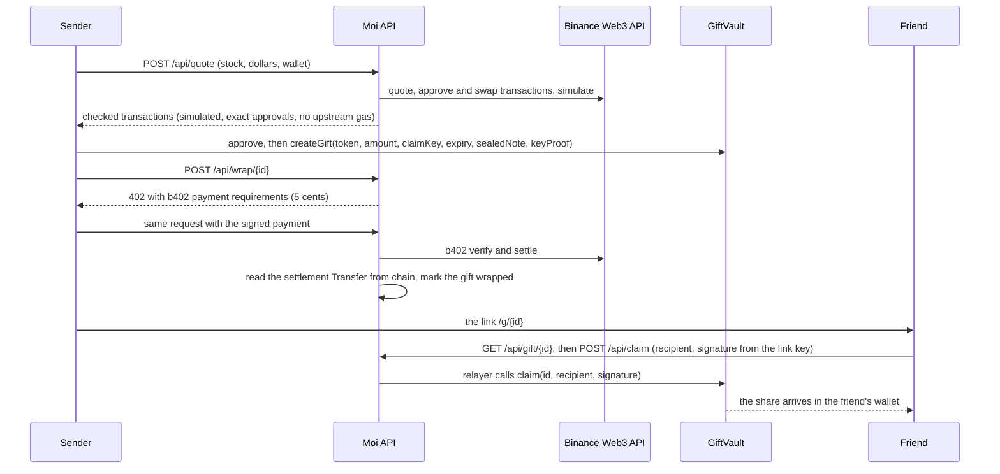
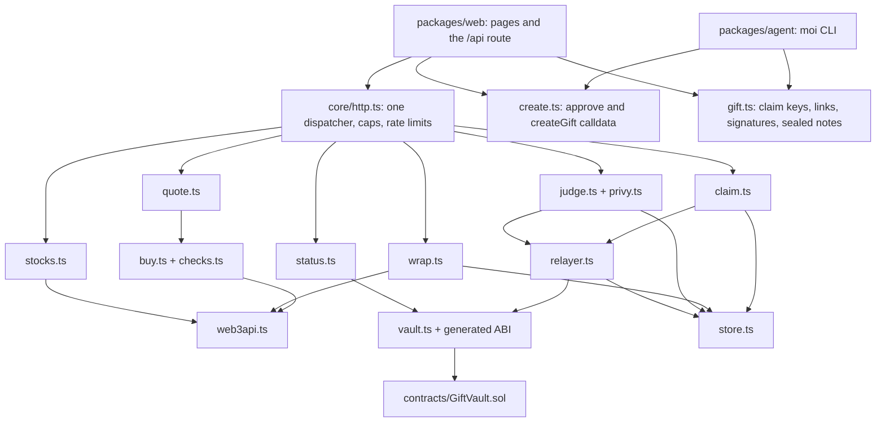

<p align="center"></p>

# Moi

Send someone their first stock as a link. They sign in with Google and own a real share, with no wallet app and no seed phrase.

Moi is the gift of money that Tamil families give at weddings, written in the family's notebook so it can be returned one day; here the gift is a real share of a company and the notebook is BNB Chain.

[Live app](https://moi-gift.vercel.app) · [Documentation](https://moi-gift.vercel.app/docs)

Built for BNB Hack: Tokenized Stocks Edition. Everything below runs on BNB Smart Chain mainnet (chain id 56) with real tokenized stocks.

## Live on BNB Smart Chain mainnet

| Thing | What it does | Address |
|---|---|---|
| GiftVault | Holds each gift until the link's key claims it or the sender takes it back. No upgrade path. | [0x808EB6B3dC1ad50Ca114F5eA9d053BEAd958975C](https://bscscan.com/address/0x808EB6B3dC1ad50Ca114F5eA9d053BEAd958975C) |
| Relayer | Moi's wallet. It sends every claim and pays the gas, so the friend pays nothing. | [0x93596EBf4e4B3ACEAb8Af2B4FeA6157e3F7fb7A9](https://bscscan.com/address/0x93596EBf4e4B3ACEAb8Af2B4FeA6157e3F7fb7A9) |
| Owner and gift wrap fee wallet | Can pause, edit the stock list and set the relayer. It cannot move a gift. The 5-cent gift wrap fee settles here. | [0x96E854aBDdc5C618ca843956d1303017b586aB75](https://bscscan.com/address/0x96E854aBDdc5C618ca843956d1303017b586aB75) |

Source verified on Sourcify (exact match): [repo.sourcify.dev/56/0x808EB6B3dC1ad50Ca114F5eA9d053BEAd958975C](https://repo.sourcify.dev/56/0x808EB6B3dC1ad50Ca114F5eA9d053BEAd958975C). Sourcify reports an exact match for both the creation and the runtime code, compiled with solc 0.8.28, verified on 7 October 2026 at 16:09 UTC. This README does not claim a BscScan verification badge.

The giftable stocks are nine bStocks, tokens on BNB Smart Chain that Binance's partner issues and backs one to one with the real security. The vault holds the list, and `listedTokens()` reads it live.

| Symbol | Name as the token reports it | Token address |
|---|---|---|
| AAPLB | Apple | [0x431a3BEE82E2ca41e49895CbECE5bB0F76A89b7A](https://bscscan.com/address/0x431a3BEE82E2ca41e49895CbECE5bB0F76A89b7A) |
| NVDAB | NVIDIA Corp | [0x02Fca66C1D1aFB4E2A7884261eB00F63598a7436](https://bscscan.com/address/0x02Fca66C1D1aFB4E2A7884261eB00F63598a7436) |
| TSLAB | Tesla, Inc. | [0x5b1910eAaD6450E50f816082Aa078C41F10C292f](https://bscscan.com/address/0x5b1910eAaD6450E50f816082Aa078C41F10C292f) |
| MSFTB | Microsoft | [0x80106cb3EAD06659A5ad19DF39D9b4733863B9b0](https://bscscan.com/address/0x80106cb3EAD06659A5ad19DF39D9b4733863B9b0) |
| AMZNB | Amazon | [0x1a4b499833A79A09ad7Cf1D42D7DacF71e92eb00](https://bscscan.com/address/0x1a4b499833A79A09ad7Cf1D42D7DacF71e92eb00) |
| GOOGLB | Alphabet | [0x3F53De71c126BdaBAe20f9cD64848d317f6C3238](https://bscscan.com/address/0x3F53De71c126BdaBAe20f9cD64848d317f6C3238) |
| METAB | Meta Platforms | [0x7425889FE94F9d693E8daefE88BCCed6AcFEf4c0](https://bscscan.com/address/0x7425889FE94F9d693E8daefE88BCCed6AcFEf4c0) |
| SPYB | SPY | [0x7138b48df7D98D7e3cc221BfE7192D0a178182D8](https://bscscan.com/address/0x7138b48df7D98D7e3cc221BfE7192D0a178182D8) |
| QQQB | Invesqo QQQ | [0x205812CdBed920aFf76C6580abD681a46D11efc7](https://bscscan.com/address/0x205812CdBed920aFf76C6580abD681a46D11efc7) |

The live transactions behind the claims in this README, all successful on chain:

| What happened | Transaction |
|---|---|
| First purchase: a real bStock bought through the Binance Trading API, 7 October 2026 | [0x6a16...a9f3](https://bscscan.com/tx/0x6a1623c52a0403c6aba600d8cf35fbc77a8830f614138152066c7a7d906aa9f3) |
| Gift 1 locked in the vault | [0xc01b...c087](https://bscscan.com/tx/0xc01b783813eb3cde47888012996e09031b98cc8d49408e7521a694b218e2c087) |
| Gift 1 claimed into a brand-new wallet, gas paid by Moi's relayer | [0x6a13...78e8](https://bscscan.com/tx/0x6a13e2e8f14630a8a4777bf7bae7befa21154fe64ba0e64d58a7ccdca71978e8) |
| Gift 2 made by the Binance Agentic Wallet: the 5-cent gift wrap paid through b402 | [0x8ec1...38d6](https://bscscan.com/tx/0x8ec1e0666350aa500bbf2f7d36b1cd97bb8dfb2e9fd5ba328b75b899a36c38d6) |
| Gift 2 claimed, no gas paid by the friend | [0x660e...e28e](https://bscscan.com/tx/0x660e8ebcc983db623db05e87fa7e0c7f4583ff208f7fdb884864d86c0825e28e) |
| Gift 3, a judge gift, claimed from the home page's judges section on 9 October 2026 | [0x2964...0eb6](https://bscscan.com/tx/0x2964c2a78897a96976e4237bd103c6e7c163eabbf2a8a956e5e0873fba000eb6) |
| Gift 11 claimed on a phone with Google on 9 October 2026, about 25 seconds after opening the link | [0x9342...c73d](https://bscscan.com/tx/0x9342094463ac3c5b725b061e6f6a8e9a40da25041e2f43931c28c37ef4b7c73d) |

On 9 October 2026, at block 126,600,254, the vault had made 11 gifts: 4 opened (gifts 1, 2, 3 and 11) and 7 waiting to be opened (gifts 4 to 10), and the waiting ones are the judge gifts. Each judge gift is about one US dollar of NVDAB. For the count right now, read the LIVE ON BNB CHAIN band on the [home page](https://moi-gift.vercel.app), or read `nextGiftId()` on the vault and subtract one.

## What Moi is

Moi lets you give a friend their first stock as a link. You pick a company and an amount from 1 to 100 US dollars. Moi gets the trade from the Binance Web3 API and checks it, your wallet buys the real tokenized share, and the share goes into a small vault on BNB Chain. Your friend opens the link, signs in with Google or email, and owns the share. They need no wallet app and no seed phrase, and they pay no network fee, because Moi's relayer pays it.

It is built for two people. The first wants to give a friend a real share, not a gift card. The second has never owned crypto and should not have to learn it to receive a gift.

A bStock records dividends by raising an on-chain multiplier, `uiMultiplier()`, so one token can stand for slightly more than one share. Moi shows the friend shares, not raw tokens.

| | Giving a stock today | Giving a stock with Moi |
|---|---|---|
| What the giver needs | A brokerage account | A wallet holding USDT and a little BNB, or the Binance Agentic Wallet |
| What the friend needs | A brokerage account of their own | A Google or email account |
| Paperwork | Account opening and a transfer form between the two brokers | One link |
| Identity checks | Both brokers run them | Moi runs none. The stock's issuer bars US persons, so Moi refuses requests from restricted places and asks the friend to declare they are not a US person |
| Time | Typically several business days, depending on the brokers | About thirty seconds is the design target. Measured once, by hand: on 9 October 2026 a phone claim with Google took about 25 seconds from opening the link to owning the share (gift 11, [claim transaction](https://bscscan.com/tx/0x9342094463ac3c5b725b061e6f6a8e9a40da25041e2f43931c28c37ef4b7c73d)) |
| If the friend never opens it | Depends on the brokers | The sender takes the gift back after it expires, 1 to 90 days |

## Features

### For the sender

- The send page at `/send`: connect Binance Wallet or MetaMask, pick one of the nine stocks, choose $1, $5, $10, $25 or your own amount up to $100, write a note, and choose how long the gift stays open (7, 30 or 90 days on the page).
- A step list shows each action as it happens: price check, allow USDT, buy the stock, let the vault hold it, seal the gift, pay the 5-cent gift wrap, link ready. The link appears as soon as the gift is locked, before the wrap, so a failed wrap never loses it.
- Every transaction Moi hands over is checked as if you had typed it: exact approvals and never unlimited, the stock sent to your own wallet, a minimum output 1 percent under the quote, a price no more than 2 percent above Binance's reference price, and a dry run on current chain state before anything is signed.
- The note is sealed in your browser with a key made from the link's key. Only someone who holds the whole link can read it.
- The agent: `moi`, a command line tool on the Binance Agentic Wallet. You set the spending limits in the Binance app. Inside them, one command buys the share, locks it as a gift, pays the 5-cent wrap with b402 and saves the link.
- If the friend never opens the gift, you take it back after it expires.

### For the friend

- Open the link, tap "Sign in to open it", use Google or email, tick the declaration, and tap "Open your gift". Moi makes a wallet for you. There is no seed phrase, and you can export the wallet's key later.
- Loading the link never claims anything. A claim happens only after you tap, and the page says "It's yours" only when the chain's receipt shows the gift paid to your wallet.
- The claim key lives in the part of the link after the `#`, which browsers never send to a server. The page removes it from the address bar before sign-in starts.

### For judges

- A "For judges" section on the home page hands each judge one real gift of about one US dollar of NVDAB, made from Moi's own wallet before judging. One per judge.
- The vault source is verified on Sourcify, and the threat model has 50 numbered rules, C1 to C50.
- The attack record: 60 attacks, all refused, with the commands to run them yourself.
- Test counts from 8 October 2026 are below, with the commands to repeat them.

## How it works

A gift has four parts: the sender buys a share, a vault on BNB Chain holds it, a link carries the key, and the friend opens it. Moi uses nine paths of the Binance Web3 API. Two belong to RWA Data, three to Trading, one to Transaction simulate and three to b402. The Binance Agentic Wallet is the agent's wallet.

1. Pick a stock. Binance RWA Data supplies the stock list's live prices and market status (`/api/v1/dex/market/rwa/tokens` and `/rwa/price`). Moi shows only the stocks the vault lists.
2. Get a quote. Binance Trading returns the quote, the approval and the swap that turn USDT into the bStock (`/api/v1/dex/aggregator/quote`, `/approve-transaction`, `/swap`).
3. Dry run. Binance Transaction simulate (`/api/v1/dex/pre-transaction/simulate`) runs the exact swap on current chain state. The wallet must pay exactly the amount, receive at least the minimum and lose nothing else. A quote that fails any check is refused, not repaired.
4. Buy. The sender's own wallet signs and sends the swap, so Moi never holds their money or their keys.
5. Seal the gift. The sender's browser makes a fresh one-time claim key, signs a short proof that this sender is registering it, seals the note and calls `createGift`. The vault records the amount it actually received.
6. Gift wrap. Binance b402 takes the 5-cent fee (`/api/v2/b402/supported`, `/verify`, `/settle`). Moi answers HTTP 402 with the price, the sender signs a payment, b402 settles it, and Moi reads the settlement from the chain before it marks the gift wrapped. Moi's relayer delivers only wrapped gifts, apart from the judge gifts.
7. Send the link. It looks like `https://<site>/g/<number>#<key>`.
8. The friend signs in. Privy makes their wallet. Their browser signs a claim message with the link's key, naming that wallet.
9. Claim. Moi's relayer sends the claim to the vault and pays the gas. The vault checks the signature, the expiry and the original sender's standing with the stock's own compliance contract, then pays the friend.
10. If nobody claims before the expiry, anyone can call `refund`, and the share goes back to the sender stored in the gift.

On the agent path, steps 4 to 6 run through the Binance Agentic Wallet command line, `baw`: `market-order quote` and `swap` buy the stock, `contract-call preview` and `execute` approve the vault and call `createGift`, and `x402-payment preview` and `sign` pay the wrap through b402.

Moi does not call the Binance Transaction broadcast endpoint. Transactions go to BNB Chain from the sender's wallet and from Moi's relayer.

System overview:



One gift, end to end:



What depends on what in the code:



## The two-minute judge path

### a. Claim a real share

1. Open https://moi-gift.vercel.app and scroll to the section marked FOR JUDGES. The top bar also has a "For judges" link.
2. Press "Sign in to claim" and sign in with Google or email. If you use email, Privy sends a code to your inbox and you type it in. Moi makes a wallet for you, and the button now reads "Claim my share".
3. Type the judge code from the submission form into the box.
4. Tick the declaration that you are not a US person and not in the US or a restricted region.
5. Press "Claim my share". Your wallet signs a short message that proves the wallet is yours, then Moi sends the share and pays the fee. The page shows "It's yours." and a link to the transaction on BscScan.

Each judge gets one gift. Moi allows one gift per sign-in, one gift per network a day, and at most four judge gifts an hour across all judges, so in a busy hour the page asks you to try again in an hour. If every judge gift is gone, the page says so.

### b. Read the chain yourself

You need Foundry's `cast` and no keys. Install Foundry with `curl -L https://foundry.paradigm.xyz | bash`, then run `foundryup`; [getfoundry.sh](https://getfoundry.sh) has the other ways. These three calls read the live vault, and they are the proof that needs no setup. The answers below were read on 9 October 2026 at block 126,600,254.

```bash
cast call 0x808EB6B3dC1ad50Ca114F5eA9d053BEAd958975C "nextGiftId()(uint256)" --rpc-url https://bsc-dataseed.bnbchain.org
cast call 0x808EB6B3dC1ad50Ca114F5eA9d053BEAd958975C "listedTokens()(address[])" --rpc-url https://bsc-dataseed.bnbchain.org
cast call 0x808EB6B3dC1ad50Ca114F5eA9d053BEAd958975C "getGift(uint256)((address,address,address,uint64,uint8,uint256,bytes))" 1 --rpc-url https://bsc-dataseed.bnbchain.org
```

```text
12
[0x431a3BEE82E2ca41e49895CbECE5bB0F76A89b7A, 0x02Fca66C1D1aFB4E2A7884261eB00F63598a7436, 0x5b1910eAaD6450E50f816082Aa078C41F10C292f, 0x80106cb3EAD06659A5ad19DF39D9b4733863B9b0, 0x1a4b499833A79A09ad7Cf1D42D7DacF71e92eb00, 0x3F53De71c126BdaBAe20f9cD64848d317f6C3238, 0x7425889FE94F9d693E8daefE88BCCed6AcFEf4c0, 0x7138b48df7D98D7e3cc221BfE7192D0a178182D8, 0x205812CdBed920aFf76C6580abD681a46D11efc7]
(0x02Fca66C1D1aFB4E2A7884261eB00F63598a7436, 0x69F1Cc47f7969dC8E2B0b1369059591A674FB15f, 0x69d6066Ee190C475652ECD464744B41A71Fce7E5, 1793982059 [1.793e9], 2, 4214744620731743 [4.214e15], 0x013b99157c...)
```

`nextGiftId()` is the number the next gift will get, so the gifts made so far are that number minus one. In the `getGift` answer the fifth value is the state: 0 none, 1 open, 2 claimed, 3 refunded. Gift 1 shows 2. The last value is the sealed note, cut short here. Both numbers rise as people send and open gifts.

The full proof script is `npm run prove`. It needs more setup than the three reads above, so those reads are the no-setup proof. Both modes load the whole `.env` first and stop with a named error unless `OC_API_KEY`, `OC_SECRET_KEY`, `DEPLOYER_PRIVATE_KEY` and `RELAYER_PRIVATE_KEY` are all there and well formed. `MOI_VAULT_ADDRESS` is optional in the dry run and required in the live run.

- Dry run, `npm run prove`: reads the chain, asks Binance for a quote and a swap for 1 USDT of NVDAB for the deployer wallet, lists the vault's tokens and prints the plan. The script checks no balance, signs nothing and sends nothing. It ends with `Dry run complete. Nothing was signed or sent.`
- Live run, `MOI_LIVE=1 npm run prove`: spends 1 USDT on mainnet. The deployer wallet signs and sends the USDT approval for the trading router (only if its allowance is short), the swap into NVDAB, the vault approval and `createGift`. The relayer wallet then sends the claim into a brand-new wallet. The deployer wallet therefore needs at least 1 USDT and some BNB for gas, and the relayer wallet needs some BNB. The run prints `PROVED: bought, gifted and claimed into a brand-new wallet through the relayer.` only after it has checked every step on chain.

Before it sends anything, the live run refuses to start unless the vault lists NVDAB, is not paused and names the address of `RELAYER_PRIVATE_KEY` as its relayer. So it cannot claim through Moi's own relayer: run it against a vault you deployed yourself with `packages/contracts/deploy.sh`. Also set `MOI_SPONSOR_ADDRESS` to the deployer wallet's address. The run's gift is not wrapped, and the claim rule delivers an unwrapped gift only from the sponsor wallet. Without that setting the claim is refused after the gift is locked, and the gift waits in the vault until it expires and `refund` returns it.

Either run then lists how long each Binance call took. Gift 1 in the transactions table was made by a live run of this script. The printout of that run is not saved in the repo, so the chain is its record.

### c. Run the attacks

```bash
cd packages/contracts && forge test --match-path "test/attacks/*" --fork-url https://bsc-dataseed.bnbchain.org -vvv
npm run attacks --workspace=@moi/core
```

The first attacks the live vault's code on a fork of mainnet. The second attacks the server code in process against a fresh vault on an anvil fork. Neither signs anything for mainnet. Re-run on 8 October 2026, the last lines were:

```text
Suite result: ok. 19 passed; 0 failed; 0 skipped; finished in 17.20s (111.22s CPU time)
Ran 1 test suite in 18.54s (17.20s CPU time): 19 tests passed, 0 failed, 0 skipped (19 total tests)
```

```text
# 41 attacks, 41 refused
```

The second command needs Foundry's `anvil` and a built `packages/contracts/out` (run `forge build` in `packages/contracts` first). It forks from a public archive node and takes about 90 seconds. The record of each attack, rule by rule, is in [docs/security/attacks/README.md](docs/security/attacks/README.md).

## Quick start for developers

You need Node 22 or newer and npm, and Foundry for the contracts. Install Foundry with `curl -L https://foundry.paradigm.xyz | bash`, then run `foundryup` ([getfoundry.sh](https://getfoundry.sh) has the other ways). The repo pins no Foundry version: `foundry.toml` pins only the Solidity compiler, 0.8.28. The counts below were run on Node 26.7.0, npm 11.19.0 and forge 1.8.1.

```bash
git clone https://github.com/ramakrishnanhulk20/Moi.git
cd Moi
npm install
npm test
cd packages/contracts && sh install-deps.sh && forge test
```

`npm test` type-checks, then runs the core and agent tests. `install-deps.sh` installs OpenZeppelin v5.7.0 and forge-std v1.17.0 into `packages/contracts/lib`. The forge run includes 10 fork tests and 19 attack tests that read BNB Chain mainnet, so it needs a network connection.

Three more commands, each of which needs `.env`:

```bash
npm run slice                       # live quote, checks and simulations, nothing signed
npm run prove                       # the dry run described above; needs the four keys, spends nothing
npm run dev --workspace=@moi/web    # the website on http://127.0.0.1:3000
```

Copy `.env.example` to `.env` at the repo root and fill it in. Never commit it. The tests need no `.env`; the commands above do. Of the names below, `npm run slice` and `npm run prove` need only `OC_API_KEY`, `OC_SECRET_KEY`, `DEPLOYER_PRIVATE_KEY` and `RELAYER_PRIVATE_KEY`. Names only, with where a stranger gets each value:

| Name | What it is for | Where you get it |
|---|---|---|
| `OC_API_KEY`, `OC_SECRET_KEY` | Moi signs every Binance Web3 API request with these. | The Binance Web3 API developer portal, web3.binance.com/en/dev-portal |
| `DEPLOYER_PRIVATE_KEY` | Deploys the vault and is the test sender in scripts. Fund it with a little BNB and USDT on BSC. | A new wallet you make for this |
| `RELAYER_PRIVATE_KEY` | Sends claims and pays their gas. It holds nothing else. Fund it with a little BNB. | A second new wallet |
| `ETHERSCAN_API_KEY` | Used only by `packages/contracts/verify.sh`, which stops at the start if it is empty. Nothing else reads it. | etherscan.io/myapikey. The free plan did not cover chain 56 when checked on 7 October 2026, so the BscScan step needs a paid plan. The Sourcify step needs no key, and the live vault's source is verified there |
| `NEXT_PUBLIC_PRIVY_APP_ID` | The Privy app that signs the friend in. Public, not a secret, 25 characters. | An app you create at dashboard.privy.io |
| `MOI_RELAYER_ADDRESS` | Public address of the relayer wallet. The deploy script reads it so it never needs the relayer key. | The address of the relayer wallet |
| `MOI_OWNER_ADDRESS` | The wallet that will own the vault. Required for a mainnet deploy. | A wallet you control |
| `MOI_VAULT_ADDRESS` | The deployed vault. The live one is `0x808EB6B3dC1ad50Ca114F5eA9d053BEAd958975C`. | The output of the deploy |
| `MOI_RELAYER_MAX_GAS_PRICE_WEI`, `MOI_RELAYER_DAILY_CAP_WEI` | Optional relayer limits. Defaults are 3 gwei and 0.002 BNB a day. | You choose them |
| `UPSTASH_REDIS_REST_URL`, `UPSTASH_REDIS_REST_TOKEN` | The shared store for claim records, locks and judge handouts. Set both or neither. | A free Upstash Redis database, region Singapore or Frankfurt |
| `MOI_WRAP_PRICE_USD` | The gift wrap fee. Default 0.05, at most 1. | You choose it |
| `MOI_PAYOUT_ADDRESS` | The wallet the wrap fees settle to. | The payout wallet in your b402 application |
| `MOI_SPONSOR_ADDRESS` | The wallet that makes judge gifts. The relayer delivers its gifts with no wrap fee. | A wallet you control |
| `MOI_PUBLIC_ORIGIN` | The site address printed in gift links. https in production. | Your site address |
| `MOI_SERVER_ORIGIN` | Where the sender agent reaches Moi's server to wrap gifts. | Your site address |
| `MOI_JUDGE_SEED`, `MOI_JUDGE_POOL` | A secret 32-byte seed (0x and 64 hex characters) the server derives judge claim keys from, and the pool of gifts it may hand out. | Any secure random generator; the pool is printed by `npm run judge-gifts --workspace=@moi/core` |
| `MOI_JUDGE_COUNT`, `MOI_JUDGE_STOCK`, `MOI_JUDGE_USD_EACH`, `MOI_JUDGE_START` | How many judge gifts to make, which stock token, dollars each, and the key index to resume from. | You choose them |
| `MOI_JUDGE_CODE` | The code judges type on the judge button. | You choose it |
| `BSC_RPC_URL` | Optional. A BNB Smart Chain node, https only. Default `https://bsc-dataseed.bnbchain.org`. | Any BNB Chain node provider |
| `MOI_ALLOW_MEMORY_STORE`, `MOI_DEV_COUNTRY`, `MOI_DEV_ALLOW_UNKNOWN_COUNTRY`, `PORT` | Local development only: run without Upstash in one process, the country a local request claims, and the port for `npm run serve`. | You choose them |

To run the sender agent, install the Binance Agentic Wallet command line with `npm install -g @binance/agentic-wallet@1.10.0`, put the five agent settings in `.env` (`MOI_VAULT_ADDRESS`, `MOI_PAYOUT_ADDRESS`, `MOI_SERVER_ORIGIN`, `MOI_PUBLIC_ORIGIN` and the optional `BSC_RPC_URL`), and run `npm run moi -- signin`. The commands are `status`, `signin`, `gift <TICKER> <USD>`, `gift <TICKER> --use-held <AMOUNT>` and `wrap <GIFT_ID>`, with the flags `--note`, `--days` and `--yes`. [The agent page](https://moi-gift.vercel.app/docs/agent) has the rest.

## Contracts and API

GiftVault is Moi's only contract. These are its functions; [the contracts page](https://moi-gift.vercel.app/docs/contracts) has what makes each one revert.

| Function | Who can call it | What it does |
|---|---|---|
| `createGift(address token, uint256 amount, address claimKey, uint64 expiry, bytes sealedNote, bytes keyProof)` | Anyone | Locks `amount` of a listed token as a new gift. The expiry must be 1 hour to 90 days away. |
| `claim(uint256 giftId, address recipient, bytes signature)` | The relayer only | Pays an open gift to `recipient`, if the signature is by the gift's claim key and the original sender passes the token's compliance check. |
| `refund(uint256 giftId)` | Anyone | Returns an expired, unclaimed gift to its sender. Not pausable. |
| `claimDigest(uint256 giftId, address recipient)` and `registerDigest(address sender)` | Anyone, read only | The digests a claim key signs. |
| `getGift(uint256 giftId)`, `listedTokens()`, `senderIsCompliant(uint256 giftId)` | Anyone, read only | Read a gift, the token list, and whether a claim would pass the compliance check now. |
| `setTokenListed(address token, bool listed)`, `setRelayer(address newRelayer)`, `pause()`, `unpause()` | Owner | Edit the token list, replace the relayer, stop or resume new gifts and claims. |
| `rescueSurplus(address token, address to)` | Owner | Sends out only tokens held above what open gifts owe. |
| `transferOwnership(address newOwner)` and `acceptOwnership()` | Owner, then the new owner | Two-step ownership change. |
| `renounceOwnership()` | Nobody | Always reverts. |

Moi's server answers six endpoints under `/api`, all JSON, with a fixed error code on every refusal. [The API page](https://moi-gift.vercel.app/docs/api) has example requests, every error code and the limits.

| Endpoint | What it does |
|---|---|
| `GET /api/stocks` | The giftable stocks with live price and market status, cached for 30 seconds |
| `POST /api/quote` | A checked, simulated approve or swap for `{stock, usdAmount, wallet}` |
| `GET /api/gift/{id}` | Public facts about a gift, read from the chain |
| `POST /api/wrap/{id}` | The 5-cent gift wrap: answers 402 with the price, then settles the signed payment through b402 |
| `POST /api/claim` | Asks the relayer to claim a gift to `recipient`, with the link key's signature |
| `POST /api/judge` | Hands a signed-in judge one gift from the judge pool |

## Test results

Run on 8 October 2026 on Node v26.7.0, npm 11.19.0 and forge 1.8.1. The last lines of each run:

```text
npm test --workspace=@moi/core
 Test Files  30 passed | 2 skipped (32)
      Tests  462 passed | 3 skipped (465)

npm test --workspace=@moi/agent
 Test Files  4 passed (4)
      Tests  59 passed (59)

forge test (in packages/contracts)
Ran 8 test suites in 87.30s (130.38s CPU time): 127 tests passed, 0 failed, 0 skipped (127 total tests)
```

The 3 skipped core tests are fork tests. They run with `MOI_FORK_TESTS=1` and need `anvil` and a network connection.

The 127 forge tests are 79 unit tests, 8 fuzz tests at 10,000 runs each, 8 reentrancy tests, 10 fork tests against the real NVDAB token, 19 attack tests on a fork of the live vault, 2 test-vector checks, and 1 invariant test. That last one checks 4 invariants across 512 runs of 128 calls each (65,536 calls in all).

What these do not cover: the website's pages, its Content Security Policy and the Privy sign-in round trip have no unit tests in this run, and the Google leg of the claim-key leak check needs a real browser. The server attack run uses fakes for three outside services: a Privy token checker, a b402 payment service that does not check the buyer's signature, and a Binance API that replays recorded answers. The fork is a copy of mainnet at one block, so it says nothing about what an issuer changes later.

## Gas in plain English

| Action | Gas | BNB at 0.05 gwei | Who pays |
|---|---|---|---|
| A claim | About 145,000 inside the call on the live vault (measured cold on a fork). The first two mainnet claims used 127,109 each and the next two about 136,700. | About 0.0000073 BNB. The real claims cost 0.0000064 to 0.0000068 BNB each. | Moi's relayer |
| Creating a gift | About 233,000 with an empty note on the live vault. Gift 1, with a 67-byte sealed note, used 348,697. | About 0.0000117 BNB for the empty-note figure | The sender |

The mainnet claims and gift 1 paid 0.05 gwei per gas, read from their receipts. The 145,000 and 233,000 figures come from the attack run in [docs/security/attacks/contract.txt](docs/security/attacks/contract.txt). The relayer's default limits are a 3 gwei ceiling and 0.002 BNB a day.

## Project structure

```text
packages/contracts   GiftVault.sol, its Foundry tests (unit, fuzz, invariant, fork, attacks), deploy and verify scripts
packages/core        Binance Web3 API client, quote checks, gift keys and links, claim relayer, b402 wrapping,
                     judge gifts, the one HTTP dispatcher, browser-side flows, prove and attack scripts
packages/agent       moi, the sender agent for the Binance Agentic Wallet
packages/web         the Next.js site: landing page, /send, /g/{id}, /docs and the /api route
docs/security        system description, threat model, and the attack record
ARCHITECTURE.md      the map: what runs where and the exact calls the website makes
```

| Layer | What Moi uses |
|---|---|
| Chain | BNB Smart Chain mainnet, chain id 56 |
| Contract | Solidity 0.8.28, OpenZeppelin Contracts v5.7.0, Foundry (forge-std v1.17.0) |
| Server and shared code | TypeScript, viem 2.57.3, zod 4.6.5, jose 6.2.12, Vitest 5.0.3 |
| Website | Next.js 16.4.0, React 19.3.0, Tailwind CSS 4.3.3, Fumadocs 16.16.2 for `/docs`, three.js and GSAP for the hero |
| Sign-in | Privy (`@privy-io/react-auth` 3.48.0), Google or email, embedded wallet |
| Binance | Web3 API (RWA Data, Trading, Transaction simulate, b402) and the Agentic Wallet (`@binance/agentic-wallet` 1.10.0) |
| Shared store | Upstash Redis over REST |
| Hosting | Vercel, configured for region sin1 with a 150-second limit on the API route |

## Security

The rules the code keeps are numbered C1 to C50 in [docs/security/threat-model.md](docs/security/threat-model.md), with the weaknesses Moi accepts named as N1 to N9. [docs/security/system-description.md](docs/security/system-description.md) says what the system does before any protection is added.

- A gift pays out once, in full, to one address: the recipient in a valid claim, or the stored sender on a refund.
- A claim needs a signature by that gift's own key over this vault, this chain, this gift and this recipient. Only Moi's relayer can submit it, and it still needs that signature.
- Nobody, the owner included, can move a gift. The vault has no upgrade path and the owner cannot renounce.
- The vault refuses to release a gift whose original sender the stock's own compliance contract now refuses.
- The claim key never reaches Moi's server. In the scripted claim run, every request the claim page's flow made to Moi and to the chain node was recorded, and the key appeared in none of their addresses, headers or bodies. In the server attack run, 22 secrets were searched for in 110 responses and 73 log lines and none was found.
- Every transaction handed to a sender is checked before it is handed over, and the sender agent signs only values it pinned itself.

The attack record is 60 attacks, all refused: 19 against the live vault's code on a mainnet fork and 41 against the server in process. Rules C13 and C29 cannot be scripted and are marked not run, and the Google sign-in leg of C12 needs a real browser. [docs/security/attacks/README.md](docs/security/attacks/README.md) lists every rule, the attack, where it ran and what came back, with the raw output in [contract.txt](docs/security/attacks/contract.txt) and [server.txt](docs/security/attacks/server.txt).

What Moi does not defend against, in short: anyone who sees a link before the friend (it is like cash in an envelope), a compromised deploy, the powers of the stock's issuer to pause a token or block an address, proving who the friend is, the friend's account at their wallet provider, market risk, the agent owner's own computer, lookalike domains, and the public record of who gave what to whom on chain.

`npm run check:leaks --workspace=@moi/web` builds the site and fails if any value from your `.env` appears in the output.

Moi is not investment advice. Gifts are not available to US persons or in restricted regions.

## Licence

MIT. See [LICENSE](LICENSE).

## Acknowledgments

Moi is built on the Binance Web3 API (RWA Data, Trading, Transaction simulate and b402), the bStocks issued by Binance's partner, the Binance Agentic Wallet, and Privy for the friend's wallet. Thanks also to OpenZeppelin Contracts, Foundry, viem, Fumadocs and Upstash.
