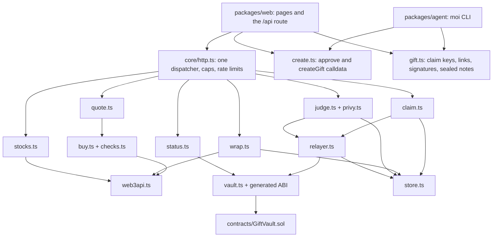

Moi's server answers six endpoints under `/api`. The website, the sender agent and the scripts all use these same six. Every endpoint answers JSON. Every answer carries `Content-Type: application/json; charset=utf-8`, `X-Content-Type-Options: nosniff` and `Cache-Control: no-store`, except the stock list, which a cache may keep for 30 seconds. A refusal always has the form `{"ok": false, "error": "<code>"}` with a fixed code. No text from Binance, the chain or the store ever reaches the browser. The full list of calls the website makes is in [ARCHITECTURE.md](https://github.com/ramakrishnanhulk20/Moi/blob/main/ARCHITECTURE.md).

## The interface

| Endpoint | Body | Answer |
|---|---|---|
| `GET /api/stocks` | none | `{stocks: [{address, symbol, name, decimals, uiMultiplier, priceUsd, market: {open, reasonCode, reasonMsg, nextOpenTime}, logoUrl}], asOf}` |
| `POST /api/quote` | `{stock, usdAmount, wallet}` | `{ok, step: "approve", approveTx}` or `{ok, step: "swap", stock, usdAmount, swapTx, vaultApproveTx, expectedOut, minOut, priceUsd}`; transactions carry only to, data and value |
| `GET /api/gift/{id}` | none | `{ok, giftId, state, token, symbol, name, decimals, amountRaw, shares, expiry, claimKey, sealedNote, senderCompliant}` |
| `POST /api/wrap/{id}` | none, then the same with a `PAYMENT-SIGNATURE` header | `402` with `PAYMENT-REQUIRED`, then `200 {ok, wrapped, txHash}`; `202 settlement_pending` means replay the same header |
| `POST /api/claim` | `{giftId, recipient, signature, declaration: true}` | `{ok, txHash, reused}` |
| `POST /api/judge` | `{judgeCode, accessToken, recipient, walletProof, issuedAt, declaration: true}` | `{ok, giftId, txHash}` |

The examples below show shapes. Where a value is a placeholder it is written in words.

### `GET /api/stocks`

The stocks a sender can gift, in the vault's own order. The token list comes only from the vault on chain. Price, market status and logo come from Binance RWA Data. They are `null` when RWA Data has nothing for a token.

Request: no body. Answer `200`, an example from 8 October 2026:

```json
{
  "stocks": [
    {
      "address": "0x02Fca66C1D1aFB4E2A7884261eB00F63598a7436",
      "symbol": "NVDAB",
      "name": "NVIDIA Corp",
      "decimals": 18,
      "uiMultiplier": "1000778223752807865",
      "priceUsd": "235.67000000",
      "market": { "open": true, "reasonCode": "TRADING", "reasonMsg": null, "nextOpenTime": null },
      "logoUrl": null
    }
  ],
  "asOf": 1791455126659
}
```

`uiMultiplier` is the token's own multiplier as a string, where 1000000000000000000 means one token per share. `logoUrl` is an https link on bnbstatic.com, or `null`. `asOf` is in milliseconds. A cached list can be up to 60 seconds older than `asOf` says.

### `POST /api/quote`

Asks for the transactions that buy a stock with USDT. Moi checks and dry-runs them before it answers. When the sender's USDT allowance to the trading router is short, the answer holds only the approval. The sender sends it, waits for it to be mined, and asks again. The amount runs from 1 to 100 US dollars, as a plain number such as `5` or `12.50`.

Request:

```json
{
  "stock": "0x02Fca66C1D1aFB4E2A7884261eB00F63598a7436",
  "usdAmount": "5",
  "wallet": "the sender's wallet address"
}
```

Answer `200`, when an approval is needed first:

```json
{
  "ok": true,
  "step": "approve",
  "approveTx": { "to": "the USDT token address", "data": "0x...", "value": "0" }
}
```

Answer `200`, when the swap is ready:

```json
{
  "ok": true,
  "step": "swap",
  "stock": "0x02Fca66C1D1aFB4E2A7884261eB00F63598a7436",
  "usdAmount": "5",
  "swapTx": { "to": "the trading router", "data": "0x...", "value": "0" },
  "vaultApproveTx": { "to": "the stock token address", "data": "0x...", "value": "0" },
  "expectedOut": "the stock amount in raw token units",
  "minOut": "the least the swap may deliver, 1 percent under expectedOut",
  "priceUsd": "the reference price in US dollars"
}
```

Every transaction carries only `to`, `data` and `value`. There is no gas limit and no gas price, so the sender's wallet works out its own.

### `GET /api/gift/{id}`

Public facts about a gift, read from the chain. The id is a plain decimal number with no sign and no leading zeros. The answer has no sender address.

Request: no body. Answer `200`, an example shape:

```json
{
  "ok": true,
  "giftId": "1",
  "state": "Open",
  "token": "the stock token address",
  "symbol": "NVDAB",
  "name": "NVIDIA Corp",
  "decimals": 18,
  "amountRaw": "the amount in raw token units",
  "shares": "the amount in shares, as a decimal string",
  "expiry": "Unix seconds",
  "claimKey": "the public address of the gift's claim key",
  "sealedNote": "0x... the encrypted note",
  "senderCompliant": true
}
```

`state` is `Open`, `Claimed` or `Refunded`. `claimKey` is the public address that the link's key must produce, not the key. `sealedNote` is ciphertext that only the link can open. `shares` is the amount times the token's own multiplier, worked out exactly with no rounding.

### `POST /api/wrap/{id}`

Takes the 5-cent gift wrap. It uses the x402 version 2 payment flow with Binance b402. Call it once with no payment to learn what is accepted.

First call, no body. Answer `402`, with the same object base64 encoded in the `PAYMENT-REQUIRED` header:

```json
{
  "x402Version": 2,
  "resource": { "url": "https://the-site/api/wrap/1", "description": "Moi gift wrapping", "mimeType": "application/json" },
  "accepts": [
    {
      "scheme": "exact",
      "network": "eip155:56",
      "amount": "50000000000000000",
      "asset": "the payment token address",
      "payTo": "Moi's payout wallet",
      "maxTimeoutSeconds": 120,
      "extra": { "name": "the token's signing name", "version": "1", "assetTransferMethod": "eip3009" }
    }
  ]
}
```

The amount is 0.05 US dollars in the token's 18 decimals. The list has one entry for each token and payment method Moi accepts. Second call, the same request with the signed payment in the `PAYMENT-SIGNATURE` header. Answer `200`, with a `PAYMENT-RESPONSE` header:

```json
{ "ok": true, "wrapped": true, "txHash": "0x... the settlement transaction" }
```

If Binance is still settling, the answer is `202` with a `Retry-After` header. Send the same request with the same header again after the pause. A gift that is already wrapped answers `200` with its settlement hash and charges nothing.

```json
{ "ok": false, "error": "settlement_pending", "retryAfterSeconds": 5 }
```

### `POST /api/claim`

Asks the relayer to claim a gift to the friend's wallet. The signature is made in the browser by the link's key and is 0x followed by 130 hex characters. `declaration` must be the boolean `true`. A `200` means the claim was submitted, not that it landed. The page waits for the receipt before it says the gift is claimed.

Request:

```json
{
  "giftId": "1",
  "recipient": "the friend's wallet address",
  "signature": "0x... the claim signature",
  "declaration": true
}
```

Answer `200`:

```json
{ "ok": true, "txHash": "0x... the claim transaction", "reused": false }
```

`reused` is `true` when a claim for that gift had already been sent. The same hash comes back and nothing is sent twice.

### `POST /api/judge`

Hands a signed-in judge one gift from the judge pool. The Privy access token proves who the judge is. The wallet proof is a signature over four lines: the words "Moi judge gift", the wallet, the Privy user and the time, made within the last 5 minutes. The server keeps every judge key, so none ever reaches the page.

Request:

```json
{
  "judgeCode": "the judge code from the submission",
  "accessToken": "the Privy access token",
  "recipient": "the judge's wallet address",
  "walletProof": "0x... the wallet's signature",
  "issuedAt": "2026-10-08T10:00:00Z",
  "declaration": true
}
```

Answer `200`:

```json
{ "ok": true, "giftId": "3", "txHash": "0x... the claim transaction" }
```

## What the browser does itself

The server never makes, sees or stores a claim key. The browser does these steps, using functions in `packages/core`:

- The sender's browser makes the claim key (`newClaimKey`), the key proof (`signKeyProof`) and the sealed note (`sealNote`). It builds the approve and `createGift` transactions (`buildApproveVaultTx`, `buildCreateGiftTx`), reads the gift number from the receipt (`readGiftIdFromReceipt`) and builds the link (`buildLink`).
- The friend's browser reads the key from the link fragment (`parseLink`), checks that it matches the gift (`claimKeyMatches`), opens the note (`openNote`), signs the claim for their Privy wallet (`signClaim`), and shows "claimed" only after the receipt holds the `GiftClaimed` event.
- A judge's browser signs `judgeWalletMessage` with the Privy wallet and sends it with the Privy access token and the judge code.

## How the code fits together



One dispatcher, `route()` in `packages/core/src/http.ts`, serves all six endpoints, for the website and for the local server alike. The path picks one of six fixed entries and nothing else, so no part of a request can choose a path, a host or a key that Moi signs with.

## Limits

| Limit | Value |
|---|---|
| Request body | 8 KB. A larger body is refused with `413 body_too_large` before it is parsed. |
| Path | At most 128 characters. |
| Requests from one client | 30 `POST` requests and 120 `GET` requests a minute, counted separately. |
| Requests from everyone | 600 a minute. |
| When a limit is hit | `429 rate_limited` with a `Retry-After` header. If the store that counts cannot answer, the answer is `502 store_unavailable`, so a broken counter never lets traffic through. |
| Wrong judge codes | More than 5 a minute from one client are answered `429 rate_limited`, even a right code. |
| Payment header | At most 8 KB of base64. |
| Waiting on Binance | 10 seconds for the Web3 API, and 25 seconds for each b402 call. One wrap request waits up to 25 seconds for a settlement before it answers `202`. |
| Reading the chain | 5 seconds per call. |
| Function time limit | 150 seconds for the API route on the host. |
| Relayer spend | A gas price ceiling and a daily cap. The defaults are 3 gwei and 0.002 BNB a day. When the day's cap is reached the answer is `429 daily_cap`. |

The client address and its country come only from the hosting platform's own headers, never from a header the caller chose.

## Error codes

Every refusal is a fixed code. Two kinds of answer can come before any endpoint runs.

| Code | Status | Meaning |
|---|---|---|
| `not_found` | 404 | The path is not one of the six, or a gift id is not a plain decimal number. |
| `method_not_allowed` | 405 | The path exists but not for that method. An `Allow` header names the right one. |
| `body_too_large` | 413 | The body is over 8 KB. |
| `bad_json` | 400 | The body is empty or is not JSON, on a route that needs JSON. |
| `rate_limited` | 429 | A rate limit was hit. |
| `store_unavailable` | 502 | The shared store could not answer. |
| `judge_gifts_closed` | 503 | No judge pool is set up. |
| `server_not_configured` | 503 | The server could not start with its settings. |
| `internal` | 500 | Something broke inside the server. Nothing was sent. |

### Quote

| Code | Status | Meaning |
|---|---|---|
| `bad_request` | 400 | The body is not exactly `stock`, `usdAmount` and `wallet`. |
| `bad_stock`, `bad_wallet` | 400 | The stock or wallet is not a usable address. |
| `not_listed` | 400 | The stock is not on the vault's list. |
| `bad_amount` | 400 | The amount is not a plain number of dollars. |
| `amount_too_small` | 400 | Under 1 US dollar. |
| `amount_too_large` | 400 | Over 100 US dollars. |
| `restricted_place`, `unknown_place` | 403 | The request comes from a restricted place, or the host could not tell where. |
| `quote_refused` | 422 | The quote failed one of Moi's checks. |
| `simulation_refused` | 422 | The dry run did not show the trade Moi expected. |
| `upstream_unavailable` | 502 | Binance did not answer. |
| `chain_unavailable` | 502 | The chain could not be read. |

### Stock list and gift status

| Endpoint | Code | Status | Meaning |
|---|---|---|---|
| `GET /api/stocks` | `upstream_unavailable` | 502 | Binance or the chain did not answer. |
| `GET /api/gift/{id}` | `not_found` | 404 | The gift was never made, or the id is not valid. |
| `GET /api/gift/{id}` | `chain_unavailable` | 502 | The chain could not be read. |

### Claim

| Code | Status | Meaning |
|---|---|---|
| `bad_request` | 400 | The body is not exactly `giftId`, `recipient`, `signature` and `declaration`. |
| `bad_gift_id`, `bad_recipient`, `bad_signature` | 400 | A field is not valid, the recipient is a contract, or the signature is not the gift's key. |
| `no_declaration` | 403 | `declaration` is not `true`. |
| `restricted_place`, `unknown_place` | 403 | The request comes from a restricted place, or the host could not tell where. |
| `gift_not_wrapped` | 402 | The gift's 5-cent wrap has not settled. |
| `gift_not_open` | 409 | The gift was already claimed or taken back. |
| `gift_expired` | 409 | The gift has expired. |
| `gift_expiring` | 409 | Less than 60 seconds remain, too soon to claim safely. |
| `sender_blocked` | 409 | The stock's issuer is holding the gift's sender. |
| `claims_paused` | 409 | The vault is paused. |
| `claim_refused` | 409 | The vault refused the claim for another reason. |
| `too_many_attempts` | 409 | The last claims of this gift failed on chain. |
| `busy` | 429 | Another claim of the same gift is in flight. |
| `daily_cap` | 429 | The relayer has spent its gas budget for the day. |
| `gas_price_high` | 502 | Network fees are above the relayer's ceiling. |
| `relayer_unavailable`, `store_unavailable`, `chain_unavailable` | 502 | The relayer, the store or the chain could not be used safely, and nothing was sent. |

### Wrap

| Code | Status | Meaning |
|---|---|---|
| `bad_gift_id` | 400 | The gift number is not valid. |
| `gift_not_found` | 404 | The vault has no such gift yet. |
| `gift_not_open` | 409 | The gift was claimed or taken back. |
| `gift_expiring` | 409 | The gift expires in under 10 minutes, so Moi takes no fee for it. |
| `wrap_in_progress` | 409 | Another payment for this gift is still being settled. |
| `payment_malformed`, `payment_mismatch`, `payment_reused`, `payment_invalid`, `payment_failed` | 402 | The payment could not be read, did not match what Moi asked for, was already used for another gift, was refused by Binance's payment service, or never reached the chain. The answer carries the payment request again. |
| `settlement_pending` | 202 | Binance is still settling. Replay the same request. |
| `settlement_unexpected` | 502 | The settlement could not be matched on chain, so the gift is not marked wrapped. |
| `facilitator_unavailable`, `store_unavailable`, `chain_unavailable` | 502 | A service could not answer. A late store failure answers 503 with the same retry fields. |
| `server_misconfigured` | 500 | The server's wrap settings are not usable. |

### Judge

| Code | Status | Meaning |
|---|---|---|
| `bad_judge_code` | 403 | The judge code is wrong. |
| `rate_limited`, `too_many_from_network` | 429 | Too many tries, or a judge gift already went to someone on this network today. |
| `bad_request` | 400 | The body is not the expected shape. |
| `bad_token`, `token_expired` | 401 | The Privy sign-in could not be read, or has expired. |
| `bad_recipient`, `bad_wallet_proof` | 400 | The wallet is not usable, or its signature could not be read. |
| `proof_expired` | 401 | The wallet proof is more than 5 minutes old, or the device clock is wrong. |
| `wallet_not_verified` | 403 | The signature did not come from the wallet named. |
| `no_declaration`, `restricted_place`, `unknown_place`, `unknown_network` | 403 | The declaration, place or network check failed. |
| `already_claimed` | 409 | This judge already claimed a gift. |
| `pool_empty` | 410 | Every judge gift has been handed out. |
| `try_again`, `gift_expiring`, `claim_refused` | 503, 409, 409 | The handout could not finish, the next gift was about to expire, or the vault refused. Try again. |
| `busy`, `daily_cap` | 429 | The relayer is busy, or it has spent its gas budget for the day. |
| `gas_price_high`, `auth_unavailable`, `store_unavailable`, `chain_unavailable`, `relayer_unavailable` | 502 | A service could not answer, and nothing was handed out. |
| `server_misconfigured` | 500 | Judge gifts are not set up correctly. |
