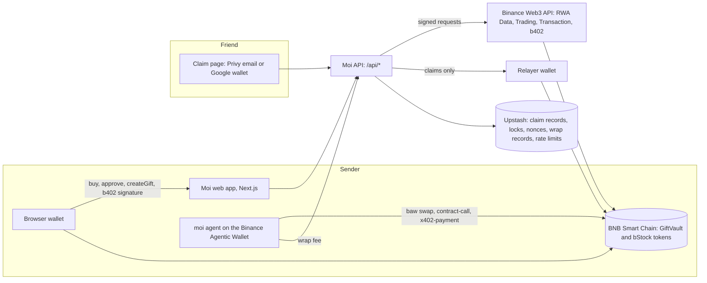
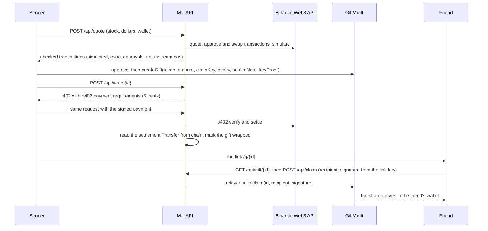

A gift has four parts: the sender buys a share, a vault on BNB Chain holds it, a link carries the key, and the friend opens it. This page follows one gift from the first tap to the last, and says which Binance service does the work at each step.

## The life of one gift

1. The sender picks a stock and an amount from 1 to 100 US dollars. The list of stocks, their live prices and whether the market is open come from Binance RWA Data. Moi shows only the stocks the vault accepts, and it reads that list from the vault itself.
2. The sender's page asks Moi for a quote. It sends the stock, the amount and the sender's wallet address. Moi asks the Binance Trading API for a quote and for the transaction that swaps USDT into the stock.
3. Moi checks the quote before it hands anything over. The swap must go through the one trading router Moi expects, and any approval must be for the exact amount and never unlimited. The swap must send the stock to the sender, with a minimum output 1 percent under the quote. The price must be no more than 2 percent above the RWA reference price. Then Moi runs the exact swap through Binance Transaction simulate, a dry run on current chain state. The dry run must show the wallet paying exactly the amount, receiving at least the minimum, and losing nothing else. A quote that fails any check is refused, not repaired.
4. The sender buys. Their own wallet signs and sends the swap, so Moi never holds their money or their keys. If the wallet has not yet allowed the trading router to spend its USDT, that approval goes alone first and the swap is quoted again after it lands. After each transaction, the page reads it back from the chain and checks it carries exactly the data Moi handed over.
5. The share goes into the vault. The sender's browser makes a fresh one-time claim key, signs a short proof with that key that this sender is the one registering it, seals the note, approves the vault for exactly the amount that arrived, and calls `createGift`. The vault records the amount it actually received. The browser then reads the gift number from the receipt, reads the gift back from the vault, and only then builds the link.
6. The sender pays the 5-cent gift wrap with b402. The page calls `POST /api/wrap/{id}` and gets back an HTTP 402 answer that lists what Moi will accept. The sender's wallet signs a payment of 0.05 US dollars in U, USD1, USDT or USDC. Moi sends the payment to b402 to verify and settle, reads the settlement from the chain, and marks the gift as wrapped. Until a gift is wrapped, Moi's relayer will not deliver it.
7. The sender sends the link. It looks like `https://<site>/g/<number>#<key>`. The key sits after the `#`, which browsers never send to a server.
8. The friend opens the link, signs in with Google or email, ticks the declaration and taps "Open your gift". Privy makes the friend's wallet at sign-in. The browser signs a claim message with the link's key, naming the friend's wallet, and sends it to Moi. The key itself is never sent.
9. Moi's relayer sends the claim to the vault and pays the network fee. The vault checks the signature, checks that the gift is still open and not expired, checks the original sender against the stock's own compliance contract, and sends the share to the friend's wallet. The page says "It's yours" only after the chain's receipt shows the gift claimed to that wallet.
10. If nobody opens the gift before it expires, the sender takes it back. After the expiry time anyone can call `refund`, and the share goes to the sender stored in the gift.

## The pieces behind each step

| Step | Piece | What it does there |
|---|---|---|
| 1 | Binance RWA Data | Live prices, market status and logos for the stock list |
| 2 and 4 | Binance Trading | The quote, the approval and the swap that buys the real bStock |
| 3 | Binance Transaction simulate | The dry run that proves the swap before anyone signs |
| 5 | The vault (GiftVault) | Holds the share until it is claimed or refunded |
| 6 | b402 | Takes and settles the 5-cent gift wrap |
| 8 | Privy | Signs the friend in and makes their wallet |
| 9 | The relayer | Sends the claim and pays its gas |
| Agent path | Binance Agentic Wallet | The sender's own wallet for the command line agent |

## Why each Binance piece is load-bearing

- RWA Data gives Moi a price to hold every trade against. Moi refuses a quote more than 2 percent above the reference price, and it refuses a stock that has no reference price at all. Without RWA Data, no buy goes through, and the stock list would show no prices or market status.
- Trading is the only way Moi turns USDT into the real bStock. Moi builds no swap of its own. The quote, the approval and the swap all come from Binance, and Moi accepts them only after its own checks.
- Transaction simulate is the check that sees inside the swap. Moi hands a swap to a sender only after the dry run proves who pays what and who receives the stock. Without it, Moi would be passing on a swap it had not proved.
- b402 is how the gift wrap is paid and settled. Moi's relayer delivers only wrapped gifts, apart from the judge gifts made from Moi's own wallet. Without b402 a gift cannot be wrapped, so it waits in the vault until it expires and the sender takes it back.
- The Binance Agentic Wallet is the sender's wallet on the agent path. Without it the agent has nothing to buy or lock with, and the sender uses the website and a browser wallet instead.

Two pieces that are not from Binance matter just as much. Without the relayer, the friend would need BNB to pay the network fee. Without Privy, the friend would need to set up a wallet before opening the gift.

## How the parts connect

## One gift, end to end

## What the friend sees

The friend opens the link and sees "Someone sent you a piece of" the company's name, with the number of shares and the date the gift stays open until. Before showing anything, the page checks that the key in the link matches the gift. A link with the wrong key or a cut-off key shows "This link doesn't open a gift" and nothing else.

The friend taps "Sign in to open it" and chooses Google or email. Moi makes a wallet for them: no seed phrase, no fees. They tick "I am not a US person, and I am not in the US or a restricted region", and the "Open your gift" button turns on.

The next screen says Moi is moving the share into their wallet and paying the network fee. BNB Chain usually confirms in a few seconds, and after 20 seconds the page says it can take up to two minutes. Then it shows "It's yours", the number of shares, the sender's note under "A NOTE FROM THE SENDER", and a link to the transaction on BscScan.

A gift that has already been opened, taken back, or has expired gets its own plain message. A gift whose sender the stock's issuer is currently holding shows "This gift can't be opened right now", and the link works again if the issuer lifts the hold before the gift expires.
